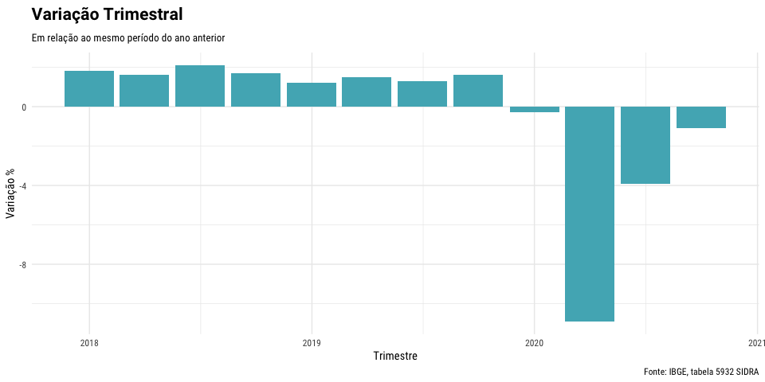
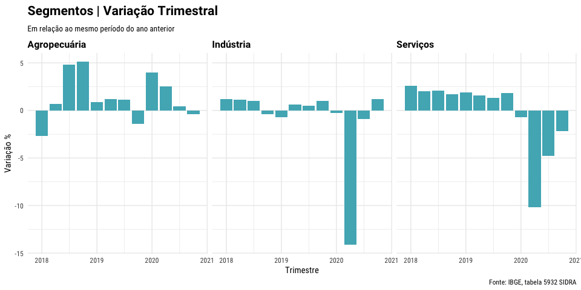
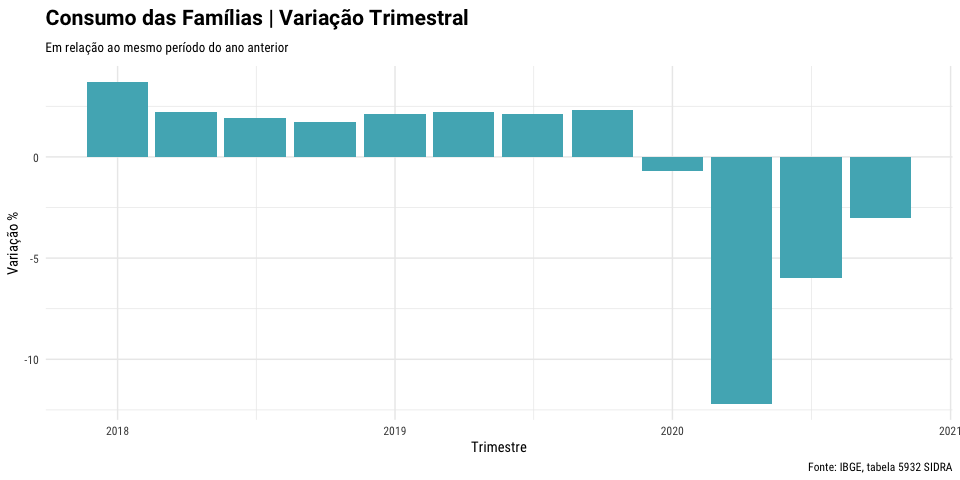
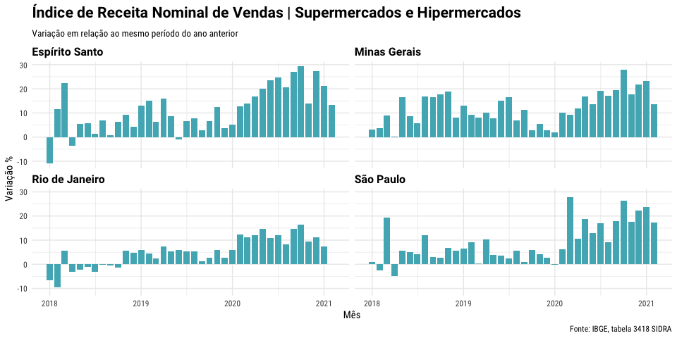
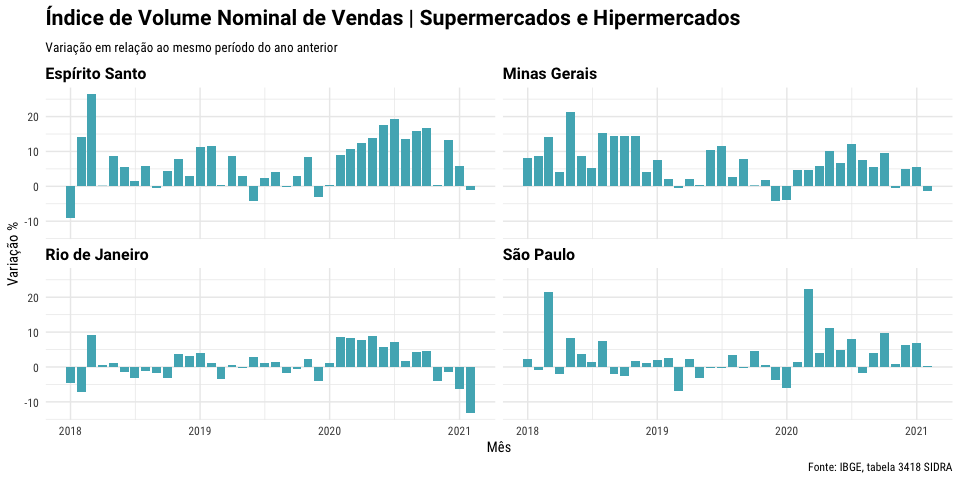
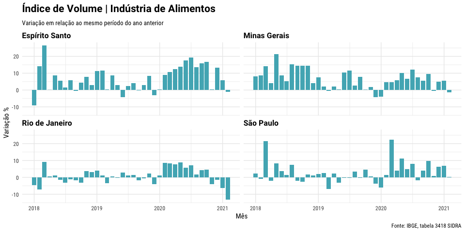
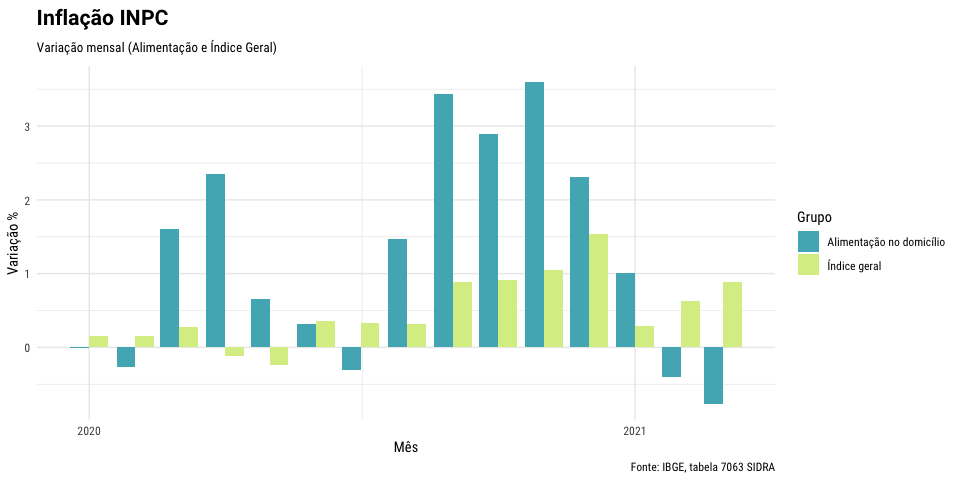

Indicadores de Conjuntura Econômica \| Indústria de Alimentos
================

# 1. Introdução

O desempenho da economia brasileira pode ser acompanhado através de
diversos indicadores disponibilizados de forma gratuita por entidades
públicas e privadas. Em geral estes indicadores são amplamente
divulgados pela impresa, mas seria possível com os dados brutos
disponíveis focar a avaliação em determinado setor da economia, ou em
uma determinada região? Os dados apresentados aqui estão filtrados sob a
ótica específica da indústria de alimentos com foco principal na Região
Sudeste, embora alguns dados tenham abragência nacional pela limitação
da própria agragação dos dados na base original.

# 2. PIB

Os dados do PIB são divulgados pelo IBGE e possuem periodicidade
trimestral. O produto interno bruto mede, a preços de mercado, o total
dos bens e serviços produzidos pelas unidades produtoras estabelecidas
no território econômico do país e destinado a usos finais. Das
componentes do cálculo do PIB, pela ótica do produto analisamos a
evolução do índice para agropecuária, industria e serviços. Já sob a
ótica da despesa será avaliada a despesa de consumo das famílias.

A variação trimestral do PIB em relação ao mesmo período do ano anterior
pode ser acompanhada no gráfico abaixo:

<!-- -->

Dos componentes do PIB, quando delimitadas pela ótica do produto podemos
obter a evolução para o comércio, serviço e indústria. Uma quarta
variável que seriam os impostos não foi analisada. O gráfico com a
variação trimestral em relação ao mesmo período do ano anterior
demonstra como o setor da agropecuária brasileira conseguiu se manter
imune a crise apesar do impacto da epidemia COVID-19.

<!-- -->

Outro aspecto interessante que pode ser extraído das informações
disponíveis da base de dados do IBGE são as despesas de consumo das
famílias. A despesa das famílias com consumo final é igual ao valor
gasto por elas com a aquisição de bens e serviços usados para atender a
suas necessidades e desejos. Essa despesa não inclui a compra de bens de
capital como máquinas e imóveis (formação bruta de capital fixo) nem a
de bens de valor, como joias e obras de arte (consideradas como
“reservas de valor”). A variação trimestral do consumo das famílias em
relação ao mesmo trimestre do ano anterior econtra-se disponível no
gráfico abaixo:

<!-- -->

 

# 3. Vendas de Supermercados e Hipermercados

A variação da receita e volume de vendas de supermercados e
hipermercados pode ser obtida através da pesquisa mensal do comércio
sendo realizada com periodicidade mensal pelo IBGE. Os próximos dois
gráficos representam a variação da receita e volume em relação ao mesmo
período do ano anterior para as quatro unidades da federação da região
sudeste.

<!-- -->

<!-- -->

# 4. Desempenho da Indústria de Alimentos

O desempenho da indústria de alimentos no Brasil pode ser acompanhado
através da pesquisa mensal da indústria disponibilizada pelo IBGE. O
resultado da pesquisa é disponibilizado com segmentação por CNAE de
forma que, para este relatório os dados se referem somente ao CNAE
relacionado a fabricação de produtos alimentícios. Além disso os dados
foram filtrados para as unidades da federação da região sudeste. A
pesquisa industrial mensal transforma os dados em índice relacionado à
produção física das unidades pesquisadas e, portanto, não representam a
evolução do faturamento das mesmas. O principal objetivo do índice é
servir como uma medida aproximada da evolução de curto prazo do valor
adicionado da indústria.

<!-- -->

# 5. Índice de Inflação

O índice de inflação escolhido para acompanhamento foi o INPC. A
população-objetivo do INPC abrange as famílias com rendimentos de 1 a 5
salários mínimos, cuja pessoa de referência é assalariada. Nesta faixa
etária o grupo alimentos corresponde a uma importante parcela do
orçamento familiar. Em momentos de recessão econômica acompanhada de
aceleração nos preços de alimentos teremos uma pressão por inclusão de
marcas e produtos mais baratos na cesta de consumo desta população. O
gráfico abaixo compara a inflação do grupo alimentos com o índice IPCA
completo.

<!-- -->  

# 4. Conclusão

Através dos indicadores aqui apresentados podemos fazer um
acompanhamento do desempenho da indústria alimentícia na economia
brasileira. Este relatório foi criado a partir de um script em
`Rmarkdown` que automatiza todo o processo de acesso e coleta de dados
junto a base de dados do IBGE.
